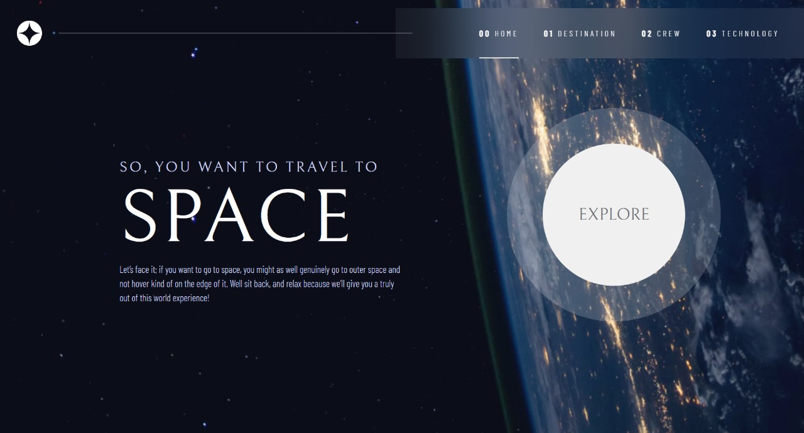

# 🚀 Space Tourism Multi-Page Website

This project is part of a *Frontend Mentor challenge, where I built a* **multi-page space tourism website**. The challenge focused on implementing a fully responsive website with multiple pages, structured design elements, and dynamic content.

## 📌 Objective
The main goal of the challenge was to *replicate a high-fidelity design* using HTML, CSS, and JavaScript. It required implementing *dynamic navigation, page transitions, and responsive layouts* while maintaining accessibility and best practices.

## 🛠 Technologies Used
- *HTML* – Structuring the content
- *React* – First experience using React for component-based development
- *SASS* – Styling with better maintainability and nesting capabilities
- *Vite* – Project bundling and fast development environment

## 🎯 What I Learned
This project marked my *first experience with React and SASS*. I learned:
- How to *create reusable components* in React
- Managing *useState and useEffect* effectively
- Handling *routing* for a multi-page experience
- Using *SCSS variables, mixins, and nesting* for cleaner styles
- Understanding *Vite's fast and optimized build process*

## 🚀 Live Demo
Check out the live preview: *https://lay2ss.github.io/space-tourism-multi-page-website/*

